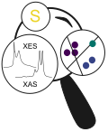
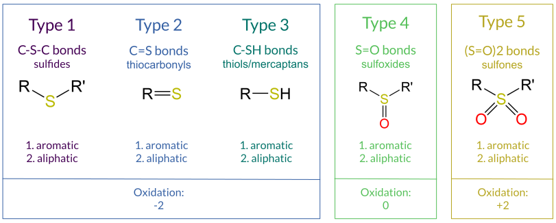
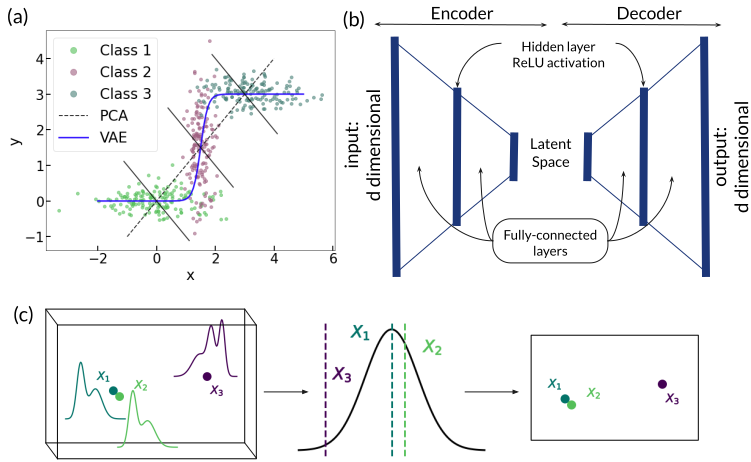
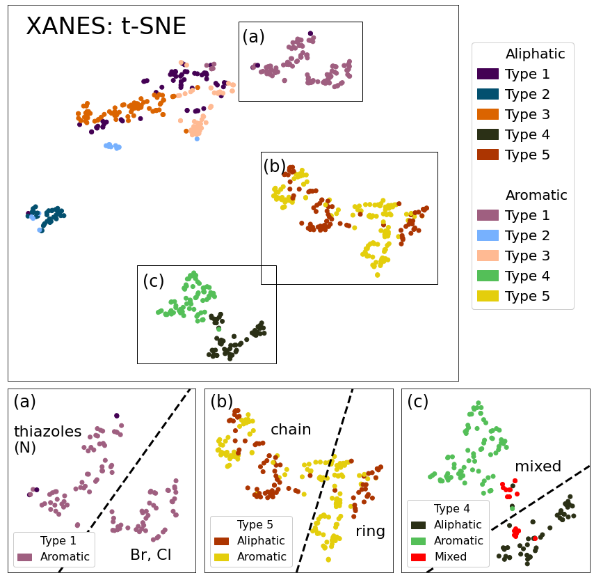

# Sulfur-ML

This repo contains the analysis of the **Valence-to-Core X-ray Emission Spectra (VtC-XES)** and **X-ray Absoprtion Near Edge Structure (XANES)** of about 800 sulforganic compounds.

<p align="center">
	
</p>


## The dataset
The compounds in this dataset includes sulforganic compounds in the following classes:



## The unsupervised machine learning algorithms include:

a. principal component analysis (PCA)

b. variational autoencoder (VAE)

c. t-distributed stochastic neighbor embedding (t-SNE)

<p align="center">
	
</p>

(a) PCA generates a linear mapping. It is a linear dimensionality reduction algorithm because the principal components create an orthogonal basis. (b) However, the VAE is a nonlinear mapping that iteratively learns how to maximize information in the latent space, or information bottleneck layer. (c) On the other hand, t-SNE is a nonlinear embedding, so it requires the entire dataset every time a lower-dimensional representation is created.


## Results
In merely two dimensions, t-SNE generated a representation with clustering of chemically-related compounds with fine detail. The results for the XANES spectra are shown below.

<p align="center">
	
</p>

(a) Separation of Type 1 aromatic compounds based on inclusion of chlorine or bromine in the aromatic system, versus thiazoles, which contain nitrogen in their rings. (b) Separation of Type 5 aliphatic copmounds based on bond strain via the inlcusion of sulfur in a ring versus a chain. (c) Type 4 compounds with one R group aromatic and the other aliphatic share characteristics of both classes and thus form the bridge between the two custers.


## Structure
1. All trained models are saved in ```models/```.
2. All compounds used in this study are listed by name under ```Categories/```.
3. The transitions calculated by NWChem (that are used to generate the spectra) are saved in ```Data/```.
4. The file that parses the NWChem data files into spectra is ```tddftoutputparser.py``` and is callled in the Jupyter notebook ```Process_Dat_to_Spectra.ipynb```, which contains the broadening values used in this study.
5. Many helper functions and visualizations are included in ```utils.py```.
